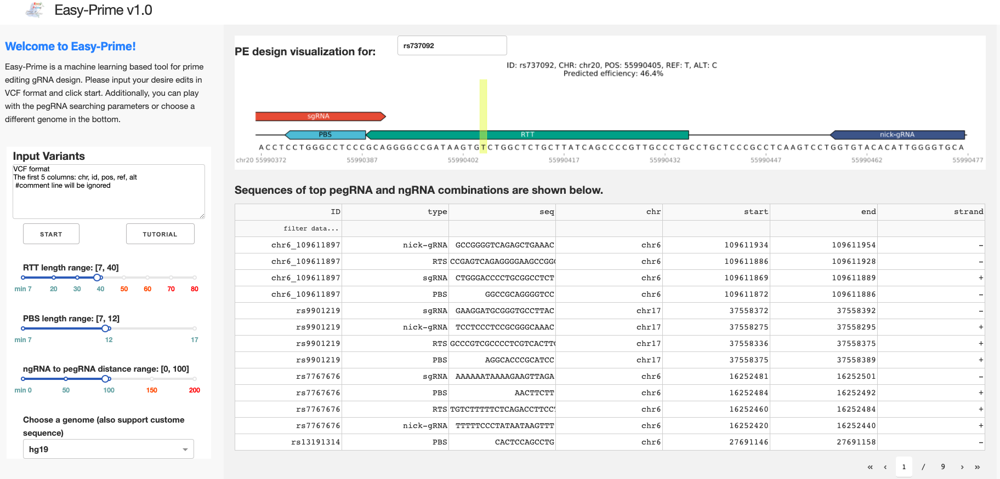

[![Version][version-shield]][version-url]
[![Python versions][python-shield]][python-url]
[![Platforms][platform-shield]][python-url]

# Easy-Prime: an optimized prime editor gRNA design tool based on gradient boosting trees

Easy-Prime provides optimized pegRNA and ngRNA combinations for efficient Prime editing design.

# Summary

PE design involves carefully choosing a standard sgRNA, a RT template that contains the desired edits, a PBS that primes the RT reaction, and a ngRNA that nicks the non-edit strand. Usually thousands of combinations are available for one single disired edit. Therefore, it is overwhelming to select the most likely high-efficient candidate from the huge number of combinations.

Easy-Prime applies a machine learning model (i.e., XGboost) that learned important PE design features from public PE amplicon sequencing data to help researchers selecting the best candidate.

# Installation

The most easiest way to install Easy-Prime is via conda.

```

conda create -n genome_editing -c cheng_lab easy_prime

source activate genome_editing

easy_prime -h

easy_prime_vis -h

```

# Usage

```

git clone https://github.com/YichaoOU/easy_prime

cd easy_prime/test

easy_prime -h

easy_prime --version

## Please update the genome_fasta in config.yaml 

easy_prime -c config.yaml -f test.vcf

## Will output results to a folder

```

Easy-Prime also provides a dash application. 

Please have dash installed before running the dash application.

```

git clone https://github.com/YichaoOU/easy_prime

cd easy_prime/dash_app

python main.py

```



# Easy-Prime on AWS

Please use this URL for now: http://easy-prime-test-dev.us-west-2.elasticbeanstalk.com/

We will deploy it to St. Jude once we get approved from the IT department.

# Tutorial

## Input

1. vcf input example

VCF headers will be ignored. Only the first 5 columns from the vcf file will be used; they are: chr, pos, name/id, ref, alt.

```
## comment line, will be ignored
chr9	110184636	FIG5G_HEK293T_HEK3_6XHIS	G	GCACCATCATCACCATCAT
chr1	185056772	FIG5E_U2OS_RNF2_1CG	G	C
chr1	173878832	rs5878	T	C
chr11	22647331	FIG3C_FANCF_7AC_PE3B	T	G
chr19	10244324	EDFIG5B_DNMT1_dPAM	G	T

```

2. fasta input example

To specify reference and alternative allele, you need two fasta sequences; `_ref` is a keyword that will be recognized as the reference allele and `_alt` is a keyword for target mutations.

```
>test_ref
AAAAAAAAAAAAAAAAAAAAAAAAAGGAAAAAAAAAAAAAAAAAAAAAAAAAAAAAAAAAAAAAAAAAAAAAAAAAAAAAAAAAAAAAAAAAAAAAAAAAAAAAAAAAAAAAAAAAAACCAAAAAAAAAAAAAAAAAAAAAAAAAAAAAAAAAAAAAAAAAAAAAAAAAAAAAAAAAAAAAAAAAAAAAAAAAAAAAAAAAAAAAAAAAAAAAAAAAAAAAA
>test_alt
AAAAAAAAAAAAAAAAAAAAAAAAAGGAAAAAAAAAAAAAAAAAAAAAAAAAAAAAAAAAAAAAAAAAAAAAAAAAAAAAAAAAAAAAAAAAAAAAAAAAAAAAAAAAAAAAAAAAAACGAAAAAAAAAAAAAAAAAAAAAAAAAAAAAAAAAAAAAAAAAAAAAAAAAAAAAAAAAAAAAAAAAAAAAAAAAAAAAAAAAAAAAAAAAAAAAAAAAAAAAA

```

## Parameters

Genome: only support hg19 for now. 

## Results

The web output contain two parts:

1. Sequence visualization

By default, the top prediction will be shown automatically. Users can input the sample ID (in the table below) to plot specific prediction.

2. pegRNA table

In this result table, each predicted sgRNA/ngRNA/RTT/PBS configuration will be provided in 4 rows, they will have the same sample ID and predicted efficiency.


# Input

A vcf file containing at least 5 columns. See `test/test.vcf` for examples.


## Searching parameters for PE design

Default values are shown in the following yaml files.

```yaml

genome_fasta: /path/to/genome.fa
scaffold: GTTTTAGAGCTAGAAATAGCAAGTTAAAATAAGGCTAGTCCGTTATCAACTTGAAAAAGTGGCACCGAGTCGGTGC
debug: 0
n_jobs: 4
min_PBS_length: 8
max_PBS_length: 17
min_RTT_length: 10
max_RTT_length: 25
min_distance_RTT5: 3
max_ngRNA_distance: 100
max_target_to_sgRNA: 10
sgRNA_length: 20
offset: -3
PAM: NGG

```

# Output

The output folder contains:

- topX_pegRNAs.csv
- rawX_pegRNAs.csv.gz
- X_p_pegRNAs.csv.gz
- summary.csv

The top candidates are provided in `topX_pegRNAs.csv`. This is a rawX format file. 

## rawX format

X means the input to machine learning models. Here, rawX basically means the file before machine learning featurization. Specifically, rawX contains 11 + 1 columns. The first 5 columns are from the input vcf file: sample_ID, chr, pos, ref, alt, where sample_ID ends with `_candidate_xxx`, this indicates the N-th combination. The next 6 columns are genomic coordinates: type, seq, chr, start, end, strand, where the `type` could be sgRNA, PBS, RTT, or ngRNA. Since for one PE design, it has to have these 4 components, which means that for one unique `sample_ID`, it has 4 rows specifying the sequences for each of them. The 12-th column, which is optional, is the predicted efficiency; in other words, the Y for machine learning.

Both `topX_pegRNAs.csv` and `rawX_pegRNAs.csv.gz` use this format.

## X format

X format is the numeric representation of rawX. `X_p` format appends the predicted efficiency to the last column of X.

## Main results

The main results, which is the top condidates, is provided in `topX_pegRNAs.csv`.

# PE design visualization

Users can visualize the predicted combinations using:

```bash

easy_prime_vis -f topX_pegRNAs.csv -s /path/to/genome_fasta.fa

```

This will output pdf files to a result dir. 

[version-shield]: https://img.shields.io/conda/v/cheng_lab/easy_prime.svg
[version-url]: https://anaconda.org/cheng_lab/easy_prime
[python-shield]: https://img.shields.io/pypi/pyversions/easy_prime.svg
[python-url]: https://pypi.python.org/pypi/easy_prime
[platform-shield]: https://anaconda.org/cheng_lab/easy_prime/badges/platforms.svg

