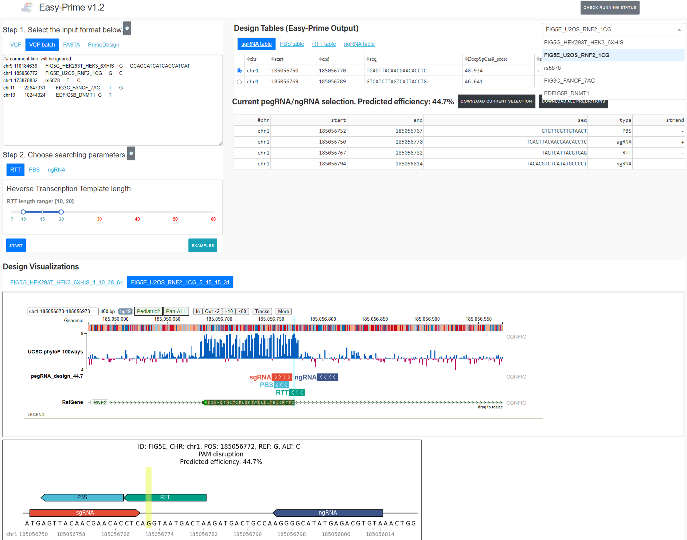

[![Version][version-shield]][version-url]
[![Python versions][python-shield]][python-url]
[![Platforms][platform-shield]][python-url]

# Easy-Prime: an optimized prime editor gRNA design tool based on gradient boosting trees

Easy-Prime provides optimized pegRNA and ngRNA combinations for efficient Prime editing design.

# Summary

PE design involves carefully choosing a standard sgRNA, a RT template that contains the desired edits, a PBS that primes the RT reaction, and a ngRNA that nicks the non-edit strand. Usually thousands of combinations are available for one single disired edit. Therefore, it is overwhelming to select the most likely high-efficient candidate from the huge number of combinations.

Easy-Prime applies a machine learning model (i.e., XGboost) that learned important PE design features from public PE amplicon sequencing data to help researchers selecting the best candidate.

# Installation

The most easiest way to install Easy-Prime is via conda.

```

conda create -n genome_editing -c liyc1989 easy_prime

source activate genome_editing

easy_prime -h

```

# Usage

```

git clone https://github.com/YichaoOU/easy_prime

cd easy_prime/test

easy_prime -h

easy_prime --version

## Please update the genome_fasta in config.yaml 

easy_prime -c config.yaml -f test.vcf

## Will output results to a folder

```

Easy-Prime also provides a dash application.

```

git clone https://github.com/YichaoOU/easy_prime

cd easy_prime/dash_app

python main.py

```



# Input

A vcf file containing at least 5 columns. See `test/test.vcf` for examples.


## Searching parameters for PE design

Default values are shown in the following yaml files.

```yaml

genome_fasta: /path/to/genome.fa
scaffold: GTTTTAGAGCTAGAAATAGCAAGTTAAAATAAGGCTAGTCCGTTATCAACTTGAAAAAGTGGCACCGAGTCGGTGC
debug: 0
n_jobs: 4
min_PBS_length: 8
max_PBS_length: 17
min_RTT_length: 10
max_RTT_length: 25
min_distance_RTT5: 3
max_ngRNA_distance: 100
max_target_to_sgRNA: 10
sgRNA_length: 20
offset: -3
PAM: NGG

```

# Output

The output folder contains:

- topX_pegRNAs.csv
- rawX_pegRNAs.csv.gz
- X_p_pegRNAs.csv.gz
- summary.csv

The top candidates are provided in `topX_pegRNAs.csv`. This is a rawX format file. 

## rawX format

X means the input to machine learning models. Here, rawX basically means the file before machine learning featurization. Specifically, rawX contains 11 + 1 columns. The first 5 columns are from the input vcf file: sample_ID, chr, pos, ref, alt, where sample_ID ends with `_candidate_xxx`, this indicates the N-th combination. The next 6 columns are genomic coordinates: type, seq, chr, start, end, strand, where the `type` could be sgRNA, PBS, RTT, or ngRNA. Since for one PE design, it has to have these 4 components, which means that for one unique `sample_ID`, it has 4 rows specifying the sequences for each of them. The 12-th column, which is optional, is the predicted efficiency; in other words, the Y for machine learning.

Both `topX_pegRNAs.csv` and `rawX_pegRNAs.csv.gz` use this format.

## X format

X format is the numeric representation of rawX. `X_p` format appends the predicted efficiency to the last column of X.

## Main results

The main results, which is the top condidates, is provided in `topX_pegRNAs.csv`.

# PE design visualization

Users can visualize the predicted combinations using:

```bash

easy_prime_vis -f topX_pegRNAs.csv -s /path/to/genome_fasta.fa

```

This will output pdf files to a result dir. 

[version-shield]: https://img.shields.io/conda/v/liyc1989/easy_prime.svg
[version-url]: https://anaconda.org/liyc1989/easy_prime
[python-shield]: https://img.shields.io/pypi/pyversions/easy_prime.svg
[python-url]: https://pypi.python.org/pypi/easy_prime
[platform-shield]: https://anaconda.org/liyc1989/easy_prime/badges/platforms.svg

