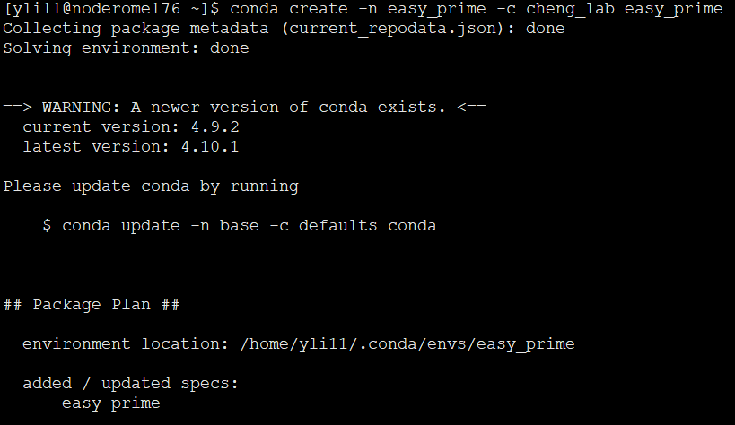
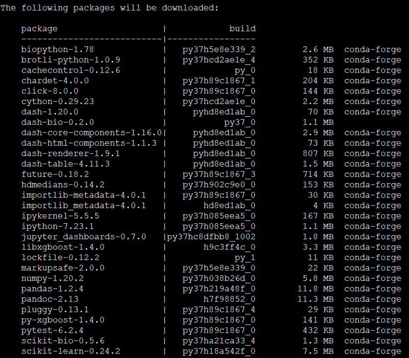
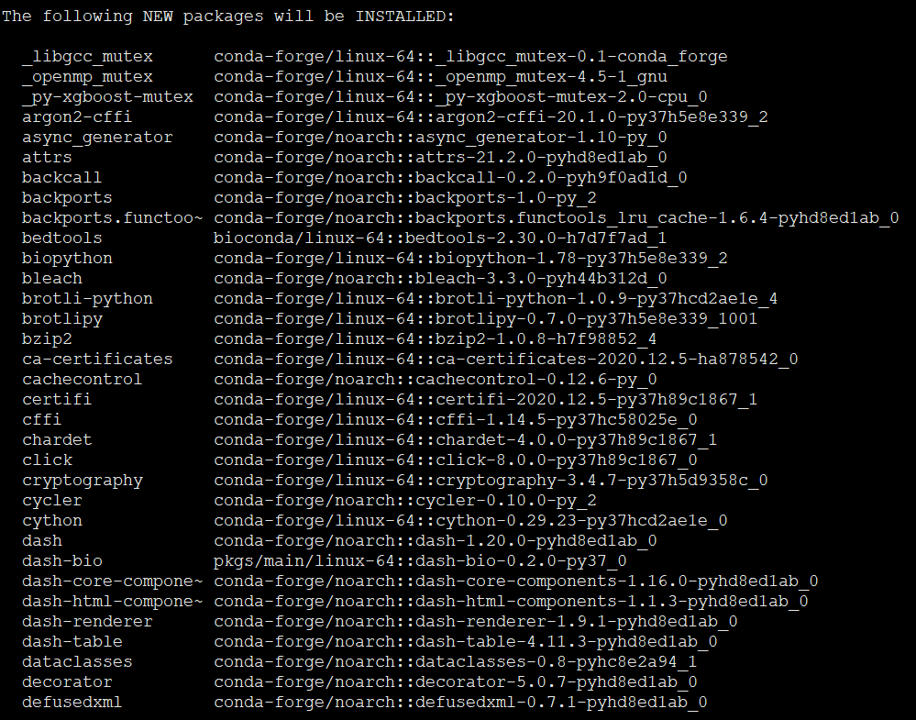
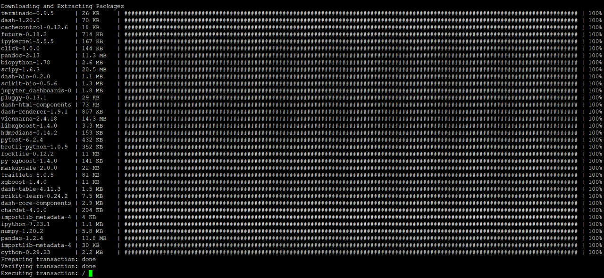
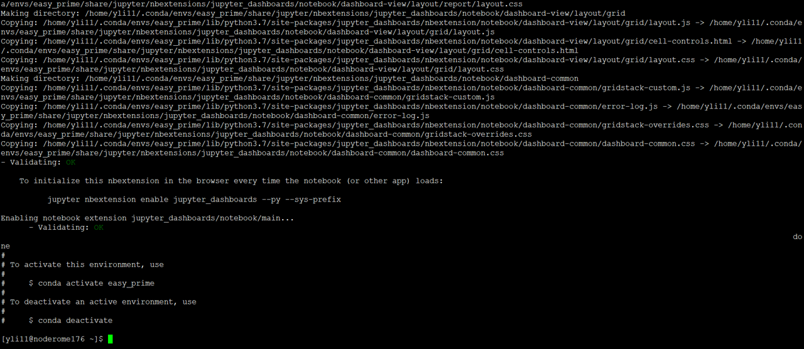
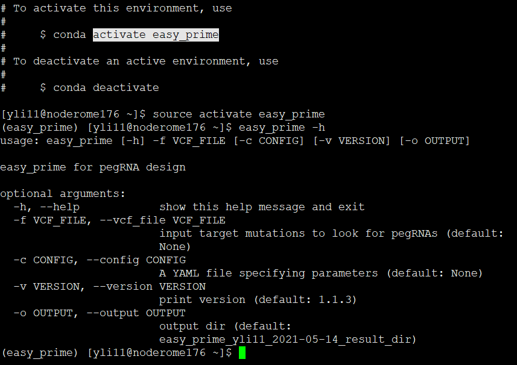

Easy-Prime Installation steps
==================

.. toctree::
	:maxdepth: 2

	index
	Installation
	AWS

Summary
^^^^^^

Installation of easy-prime is really easy, however, you might experience errors due to lower conda version problem. Please make sure that you have conda installed and conda version >= 4.9.

Steps
^^^^^

The installation may take 20 min.

Stage 1. Type the installation command
-------------------------

::

	conda create -n easy_prime -c cheng_lab easy_prime

Please note that ``-n ENV_NAME``, the ``ENV_NAME`` can be anything strings without space. ``-c cheng_lab easy_prime`` means installation the compiled conda package (namely easy_prime) from ``cheng_lab`` channel.

Stage 2. Type y to start installation
-------------------------

Once you have typed in the ``conda create`` command, the conda program will start to gather information, for example, informing you about new conda version. Then it tells you a "Package Plan", for new packages to be downloaded and installed.

.. image:: images/step2.3.png
	:align: center

Now, type ``y`` and enter.

Stage 3. Waiting for installation, may take 20 min
-------------------------

Stage 4. Installation is completed
-------------------------

The terminal says, "To activate, use conda activate easy_prime".

To use ``conda activate`` or ``source activate`` depends on the operating system. In Mac and Linux, please use ``source activate easy_prime``. 

Stage 5. Print Easy_prime help message
-------------------------

Type, ``easy_prime -h``

