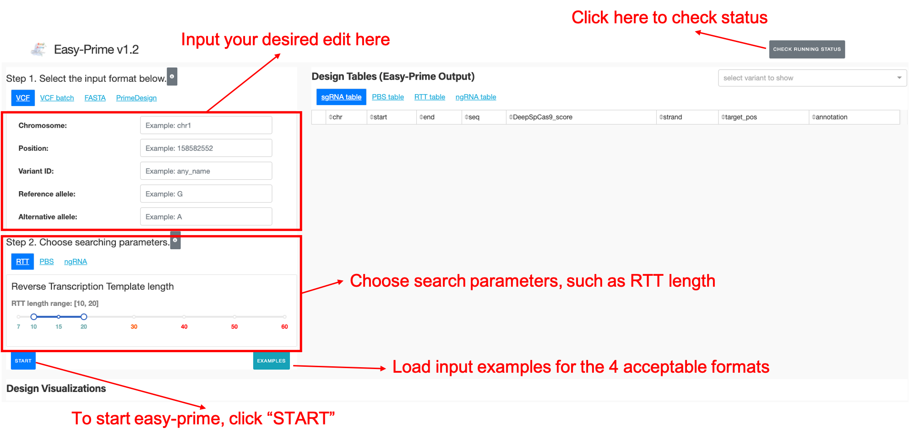
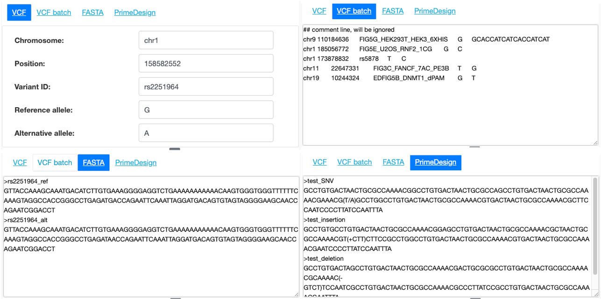
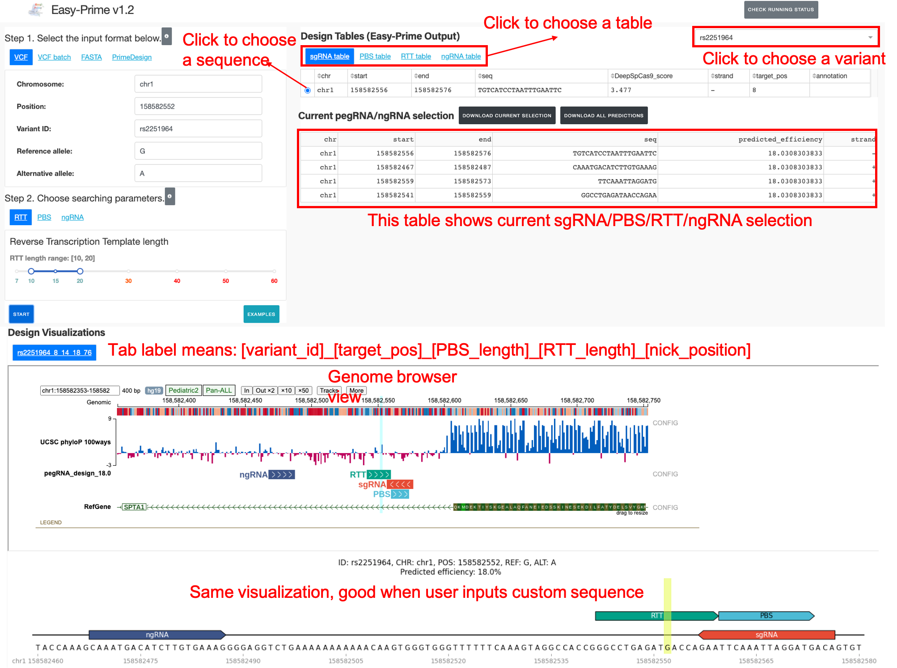

Easy-Prime Web server tutorial
==================

.. contents:: 
    :local:

Welcome to Easy-Prime
^^^^^^

Easy-Prime is a machine learning based tool for prime editing gRNA (pegRNA) design. Please input your desire edits in VCF format or FASTA format and click start. Additionally, you can play with the pegRNA/ngRNA searching parameters. Outputs include a bed-like table and genome-browser visualization.

This web server is based on Dash. URL is: http://easy-prime.cc/ 

.. note:: Currently, this web portal only supports hg19. 

Get Started
^^^^^

Go to the easy-prime web portal, the webpage looks like below:

Here, you can find areas to input target mutations, to choose different searching parameters, and output visualizations, including a bed-like table and a genome-browser visualization.

For starter, you can first click ``Examples`` to automatically load input examples for the 4 acceptable formats.

If you experience error (very likely due to incorrect input format), you can click the ``check running status`` button for error messages. Note that it may not be able to capture all kinds of errors.

.. note:: If you do experience error and everything seems not working, please refresh the browser and start over. If the issue is still there, please email us.

Input formats
^^^^^

The program accepts 4 types of formats. The first two are VCF-like formats. Basically we need 5 types of information, which are: chr, pos, ID, ref, alt, specified in the first 5 columns in a vcf file.

The last two are fasta-like formats. Basically users can input DNA sequences and the program will automatically determine the target mutation and optimize pegRNA/ngRNA design.

VCF format
----------

::

	## comment line, will be ignored
	chr9	110184636	FIG5G_HEK293T_HEK3_6XHIS	G	GCACCATCATCACCATCAT
	chr1	185056772	FIG5E_U2OS_RNF2_1CG	G	C
	chr1	173878832	rs5878	T	C
	chr11	22647331	FIG3C_FANCF_7AC_PE3B	T	G
	chr19	10244324	EDFIG5B_DNMT1_dPAM	G	T

The ``VCF`` tab is used for single target mutation and the ``VCF batch`` tab is used for any number of target mutations (prefer less than 10 mutations). The server prohibits output file size > 50M. If you want to design pegRNAs for large number of mutations, please download the command line program.

Note that this format is a tsv format, please do not confuse the program with space or comma. You can first create the input in excel and then copy and paste it to the text box.

FASTA format
----------

::

	>rs2251964_ref
	GTTACCAAAGCAAATGACATCTTGTGAAAGGGGAGGTCTGAAAAAAAAAAACAAGTGGGTGGGTTTTTTCAAAGTAGGCCACCGGGCCTGAGATGACCAGAATTCAAATTAGGATGACAGTGTAGTAGGGGAAGCAACCAGAATCGGACCT
	>rs2251964_alt
	GTTACCAAAGCAAATGACATCTTGTGAAAGGGGAGGTCTGAAAAAAAAAAACAAGTGGGTGGGTTTTTTCAAAGTAGGCCACCGGGCCTGAGATAACCAGAATTCAAATTAGGATGACAGTGTAGTAGGGGAAGCAACCAGAATCGGACCT

We use a keyword to recognize the reference and mutated sequences and they are ``_ref`` and ``_alt``. In this example, variant name is ``rs2251964``, but it can be string without spaces.

We suggest the input sequence length is at least 100bp.

PrimeDesign format
----------

::

	>test_SNV
	GCCTGTGACTAACTGCGCCAAAACGGCCTGTGACTAACTGCGCCAGCCTGTGACTAACTGCGCCAAAACGAAACG(T/A)GCCTGGCCTGTGACTAACTGCGCCAAAACGTGACTAACTGCGCCAAAACGCTTCCAATCCCCTTATCCAATTTA
	>test_insertion
	GCCTGTGCCTGTGACTAACTGCGCCAAAACGGAGCCTGTGACTAACTGCGCCAAAACGCTAACTGCGCCAAAACGT(+CTT)CTTCCGCCTGGCCTGTGACTAACTGCGCCAAAACGTGACTAACTGCGCCAAAACGAATCCCCTTATCCAATTTA
	>test_deletion
	GCCTGTGACTAGCCTGTGACTAACTGCGCCAAAACGACTGCGCGCCTGTGACTAACTGCGCCAAAACGCAAAAC(-GTCT)TCCAATCGCCTGTGACTAACTGCGCCAAAACGCCCTTATCCGCCTGTGACTAACTGCGCCAAAACGAATTTA

Please see https://github.com/pinellolab/PrimeDesign#primedesign-input-sequence-format for more information.

We use PrimeDesign format as a FASTA format, the fasta header is used as the variant name.

Please note that the ``Combinatorial edits`` format is not supported, e.g., ``GC(G/T)CCA(+ATCG)AAA``

Searching Parameters
^^^^^^

Here users can change RTT length, PBS length, and nick-gRNA distance. We suggest users just use the default settings.

Output pegRNA/ngRNA design tables
^^^^^^^^^^^^^^^^^

Once easy-prime is finished, default sgRNA, PBS, RTT, ngRNA selection is set to be the one with the highest predicted editing efficiency.

Users can click on each tab (e.g., PBS table tab) to choose other sequences. Selection of sgRNA triggers updates of PBS, RTT, and ngRNA table, since there 3 components are unique for each sgRNA. Each selection triggers the genome browser visualization in the bottom.

To download all results for current Easy-Prime prediction, click the ``Download all prediction`` button. This will download all prediction in a bed-like format as a zip file. Remember that Easy-Prime exhaustively searches all combinations, this is a big file.

To download your current selection, click "Download current selection". This is a bed-like format containing the 4 components of a pegRNA/ngRNA, which are sgRNA, PBS, RTT, and ngRNA.

Output pegRNA/ngRNA genome browser visualization
^^^^^^^^^^^^^

Genome browser view is powered by Protein Paint (https://pecan.stjude.cloud/proteinpaint). You can zoom in to actually see the DNA bases.

However, we only support hg19 in the tracks. So then the second visualization, will be better if your input is in FASTA format (e.g., if you have hg38 variant, you can first extract +/- 100bp sequence and input here).
